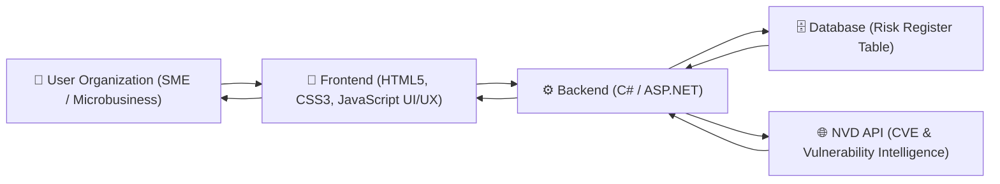
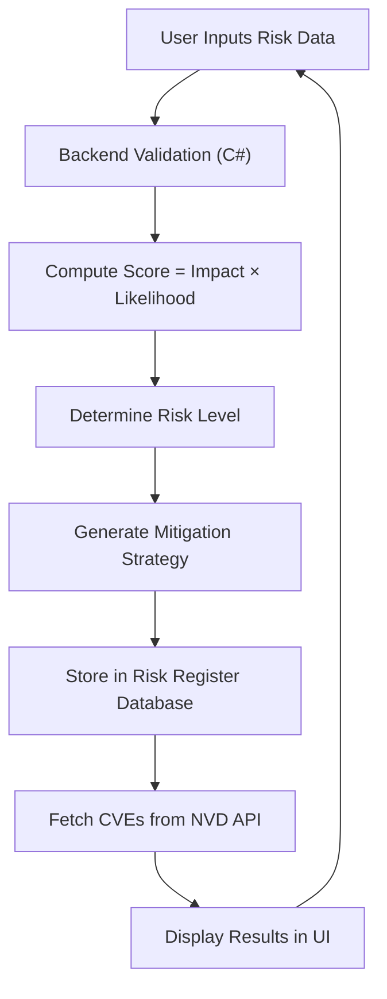
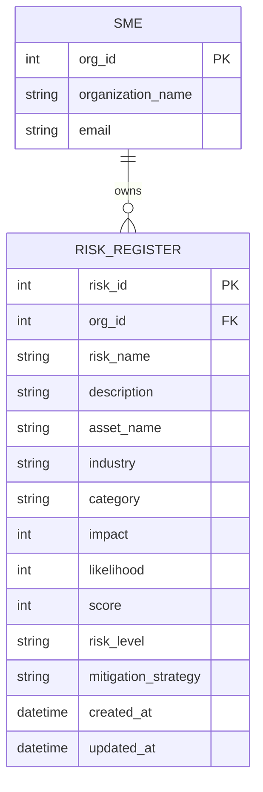

# 🛡️ CyberRiskLingo

### Cyber Risk Register & Visualization Platform for SMEs

---

## 🌐 Project Overview

CyberRisk Lingo is a cybersecurity risk management web application designed for small and medium-sized enterprises and microbusinesses that operate without dedicated security teams yet face increasing exposure to cyber threats.

The platform provides a structured and intuitive way to document, assess, and manage cyber risks through a centralized risk register. It combines automated risk scoring, tailored mitigation strategies, and visual dashboards to help organizations understand and prioritize their security posture.

Rather than overwhelming users with technical complexity, SentinelWeave translates cybersecurity into a practical, accessible workflow that supports real-world decision-making.

---

## 🎯 Purpose

The purpose of CyberRisk Lingo is to bridge the gap between cybersecurity expertise and business usability.

The platform enables organizations to:

* Understand their cyber risks in a structured manner
* Prioritize vulnerabilities based on severity
* Take actionable mitigation steps
* Visualize organizational risk exposure clearly

---

## 👥 Target Audience

* Small and Medium Enterprises (SMEs)
* Startups and SaaS companies
* Microbusinesses
* Founders and operational teams

---

## ⚙️ Core Features

### 📝 Risk Register (CRUD System)

Create, view, update, and delete structured cyber risk entries through input attributes such as the risk name, description of the risk, asset involved, industry the organization deals with, category compromised (Confidentiality/Integrity/Availability), impact (1-10), likelihood (1-10). The CRUD system refelects the appropriate risk level, score, and mitigation strategy.

### 📊 Automated Risk Scoring

Risk score is computed dynamically as Impact multiplied by Likelihood. 

### 🧠 Mitigation Strategy Generation

Tailored mitigation recommendations based on asset, category, risk level, and score. The mitigation stratgey also depends upon the vulnerabilities the assets inherently comprise. 

### 🔥 Organizational Dashboard

Color-coded heat map visualization for intuitive risk prioritization and display of the user organization's current risk posture. 

### 🌐 Threat Intelligence Integration

Integration with external vulnerability data sources to provide real-world context and latest cyber threats the assets are exposed towards. 

### 🔐 Secure Authentication

User authentication with validation and secure handling of inputs. The authentication occurs with organizational emails. 

---

## 🧱 Technology Stack

### Frontend (UI/UX Design)

HTML5
CSS3
JavaScript

### Backend (CRUD Application)

C# using ASP.NET with MCV infrastructure:
1. Models: Data attributes involved to be fetched for analysis
2. Controllers: Home Controller (Login, Authentication), API Controller (using integrated web services for vulnerability discovery)
3. Views: Different layouts for each CRUD functionality as well as threat map visualization
RESTful API architecture

### Database

SQL-based system (MongoDB to store and record input user organizational asset risk information). MongoDB is an appropriate choice because it supports easy CRUD operations, scalability, and has a flexible database schema. 
---

## 🗄️ Database Schema (Structured Risk Register Table)

The database is designed around a centralized **Risk Register Table** that captures all relevant cybersecurity risk attributes for an organization.

### 📊 Risk Register Table Structure

| Field Name          | Data Type    | Description                                                   |
| ------------------- | ------------ | ------------------------------------------------------------- |
| risk_id             | INT (PK)     | Unique identifier for each risk entry                         |
| org_id              | INT (FK)     | References the user organization                              |
| risk_name           | VARCHAR(255) | Name of the identified risk                                   |
| description         | TEXT         | Detailed explanation of the risk                              |
| asset_name          | VARCHAR(255) | Asset associated with the risk                                |
| industry            | VARCHAR(100) | Industry of the organization                                  |
| category            | VARCHAR(50)  | CIA classification (Confidentiality, Integrity, Availability) |
| impact              | INT          | Impact score (1–10 scale)                                     |
| likelihood          | INT          | Likelihood score (1–10 scale)                                 |
| score               | INT          | Computed value (impact × likelihood)                          |
| risk_level          | VARCHAR(20)  | Derived classification (Low, Medium, High)                    |
| mitigation_strategy | TEXT         | System-generated mitigation recommendation                    |
| created_at          | DATETIME     | Timestamp of creation                                         |
| updated_at          | DATETIME     | Timestamp of last update                                      |

---

### 🧠 Data Logic

* **Score Calculation:**
  Score = Impact × Likelihood

* **Risk Level Classification:**

  * Low: 1 – 20
  * Medium: 21 – 50
  * High: 51 – 100

* **Mitigation Strategy:**
  Generated dynamically based on:

  * Asset type
  * Risk category (CIA)
  * Risk level

---

## 🎨 UI / UX Design Mockups

The SentinelWeave AI interface has been designed with a strong focus on usability, clarity, and accessibility for non-technical users. The design follows a clean, light-themed aesthetic with structured layouts and minimal cognitive load.

The interface is built around four primary views:

### 🧭 Key Screens

* **Login Page**
  Simple and secure authentication interface with clear input fields and feedback

* **Home Dashboard**
  Introduces the platform with a guided workflow explaining how users can assess risks

* **Risk Register (CRUD Interface)**
  Core functionality allowing users to create, edit, view, and delete risk entries
  Includes real-time computation of:

  * Risk score
  * Risk level
  * Mitigation strategy

* **Organizational Dashboard**
  Visual representation of risks using a **color-coded heat map**
  Displays:

  * Risk distribution
  * High-risk assets
  * Relevant external threats

* **Help & Profile Section**
  Provides user details and support contact

---

### 🎯 Design Principles

The design strictly follows usability best practices:

* Minimalist interface with structured layouts
* Clear system feedback (real-time updates)
* Consistent navigation patterns
* Error prevention and validation
* Visual hierarchy for decision-making

Color usage is intentional and restrained:

* Green → Low Risk
* Yellow → Medium Risk
* Red → High Risk

---

### 🖼️ UI Mockup Preview

#### Login Interface

### Home Page

#### Risk Register Interface

#### Organizational Dashboard (Heat Map)

 
 

### Web Services Integration (Vulnerabilities)

### Help Section

---

### 🔗 Figma Design Link

👉 **View Full Interactive Design Prototype:**
https://option-azul-21364206.figma.site/

---

### 🧩 Design Note

The UI is intentionally designed to feel like a real SaaS cybersecurity product rather than a conceptual prototype. Each interaction reflects actual backend functionality, ensuring consistency between design and implementation.

---

### Web Service Integration

Integration with the **National Vulnerability Database (NVD) API**

Purpose of API:

* Retrieve known vulnerabilities (CVEs)
* Provide severity scoring (CVSS)
* Enhance user awareness of threats affecting their assets

---

## 🏗️ System Architecture

---

### 🔍 Component Interaction

The user organization interacts with a clean frontend interface to manage risks.

The frontend communicates with the backend, which:

* Validates inputs
* Calculates risk score
* Determines risk level
* Generates mitigation strategies

The backend stores all information in the database and integrates with the NVD API to fetch relevant vulnerabilities associated with user-defined assets.

---

## 🔄 Application Workflow

---

## 🧾 Risk Data Model

Each risk entry includes:

* Risk Name
* Description
* Asset Name
* Industry
* Category (Confidentiality, Integrity, Availability)
* Impact (1–10)
* Likelihood (1–10)
* Score (automatically calculated)
* Risk Level (Low, Medium, High)
* Mitigation Strategy

---

## 🗄️ Database Schema (ERD)

---

## 🌍 API Integration (NVD)

The system integrates with the National Vulnerability Database API to provide real-world cybersecurity intelligence.

When a user inputs an asset, the system retrieves:

* Known vulnerabilities (CVEs)
* Severity scores (CVSS)
* Vulnerability descriptions

This allows organizations to understand how their assets are exposed to real-world threats and strengthens decision-making.

---

## 🎨 UI / UX Design

The application follows a clean and minimal design approach:

* Light theme with subtle color usage
* Clear navigation across modules
* Real-time system feedback
* Accessible and responsive layout

Design is aligned with usability principles to ensure ease of use for non-technical users.

---

## 📊 Dashboard Capabilities

* Risk heat map visualization
* Distribution of risks by severity
* Identification of high-risk assets
* Display of relevant cybersecurity threats

---

## 📅 Development Timeline

Week 1
Project setup and database schema design

Week 2
Backend CRUD implementation

Week 3
Frontend development

Week 4
Risk scoring and mitigation logic

Week 5
Dashboard and API integration

Week 6
Security implementation and testing

---

## ⚠️ Challenges and Mitigation

### Data Accuracy & Incompatibility

Users may provide inconsistent inputs and incorrect assessments of the risk impact and likelihood of the assets.
During the project, there can be certain programming or database storage packages which may be incompatible. 
Solution: Input validation and structured fields.
Backup packkages for the project in case of incompatibility.

### API Reliability

External APIs may have limitations or cannot provide the consistent vulnerabilities aligend with the risks idenitified. 
Solution: Error handling and fallback mechanisms

### Security Risks

User inputs may introduce vulnerabilities. Furthermore, the project introduces the concern of storing proprietary organizational data of involved assets at the backend. Therefore, there needs to be utmost security of organizational data at backend.
Solution: Input sanitization, authentication, and backend database encryption. 

### Usability

Cybersecurity complexity for SMEs and greater application learning curve for user organizations to understand application workflow.
Solution: Simple interface and guided workflows

---

## 🚀 Future Enhancements

* AI-driven risk predictions
* Advanced analytics dashboards
* Compliance mapping (NIST, ISO)
* Multi-organization support

---

## 👤 Author

**Vanya Sahi**
Cybersecurity Architect

Focused on building systems at the intersection of:

* Cyber risk analysis
* Threat intelligence
* Practical AI-driven security solutions

---

### 🛡️ SentinelWeave 

Making Cyber Risk Understandable, Actionable, and Visual

