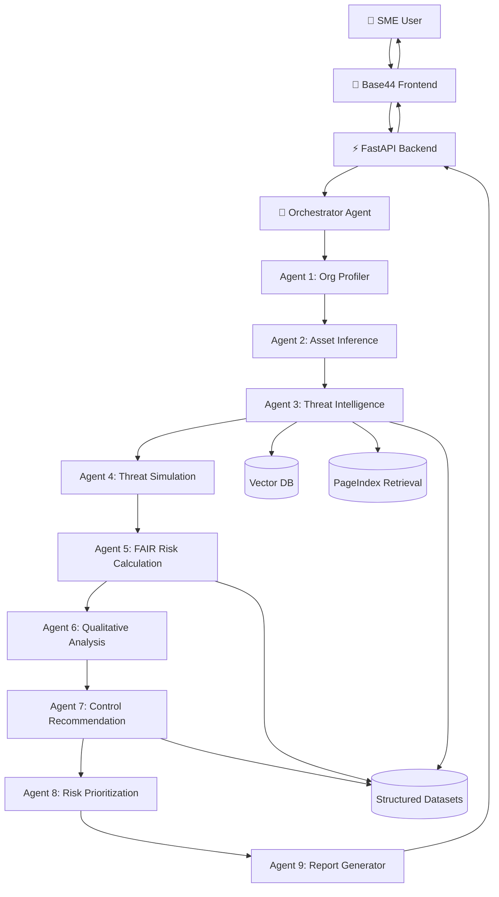
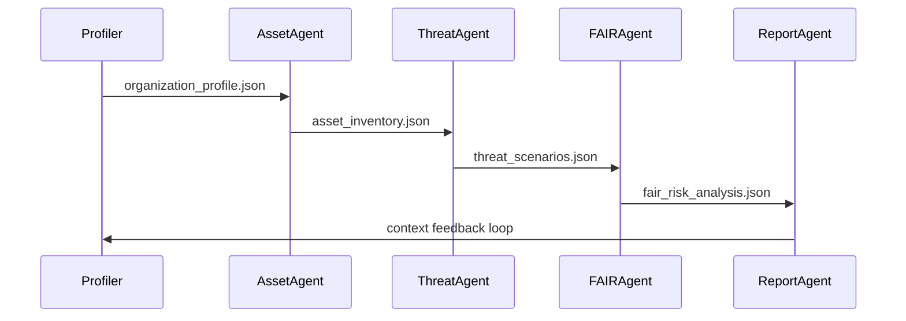
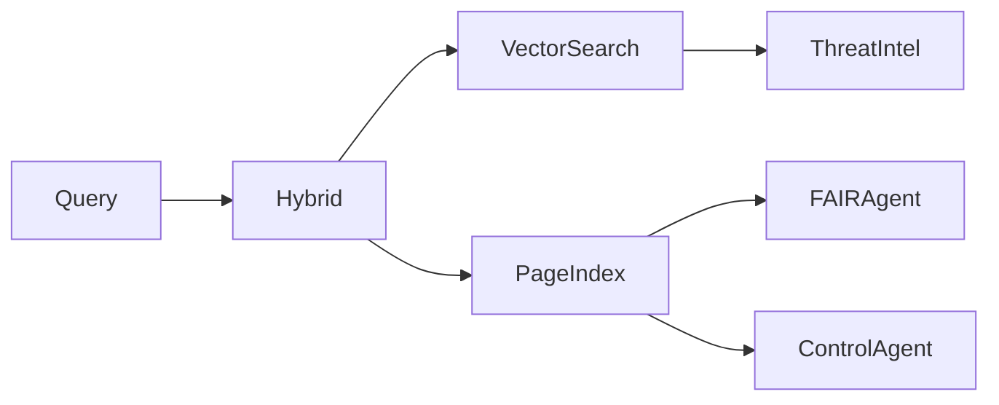
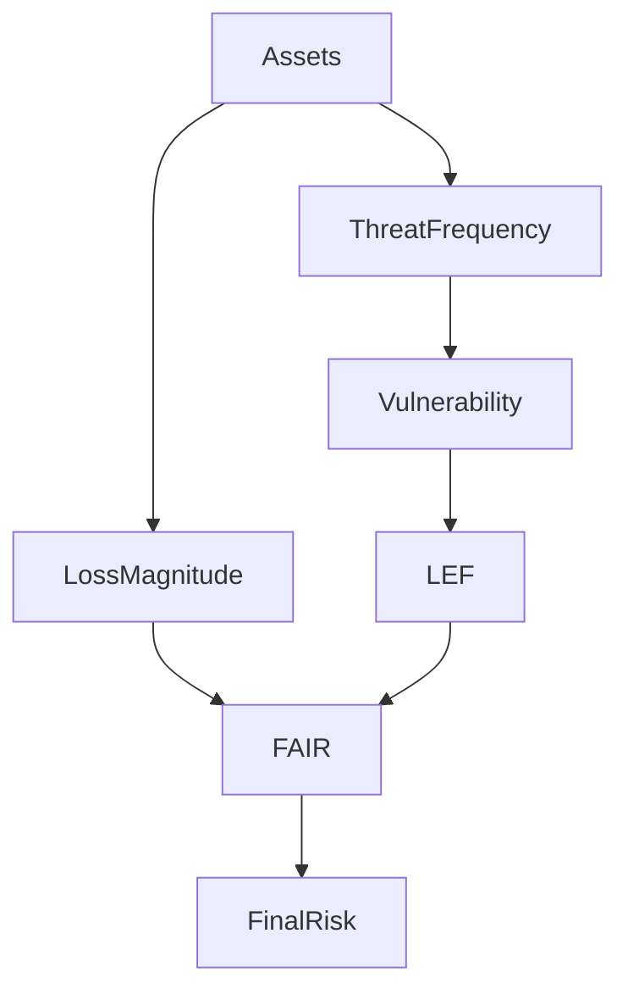
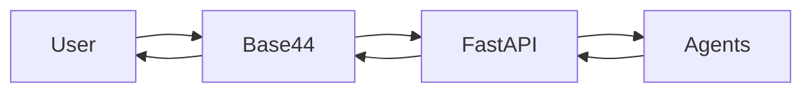

<div align="center">

# 🛡️ SentinelWeave AI

### AI‑Native Cyber Risk Analysis & Threat Modeling Platform for SMEs

<p align="center">


</p>

</div>

---

# 🌐 Overview

**SentinelWeave AI** is a next‑generation **AI‑native cyber risk analysis and threat modeling platform** designed specifically for Small and Medium Enterprises (SMEs).

Unlike traditional cyber risk tools that rely on static questionnaires, SentinelWeave AI uses:

* 🧠 Natural language understanding
* 🤖 Multi‑agent reasoning
* 🔗 Model Context Protocol (MCP)
* 📊 FAIR quantitative risk modeling
* 🎯 Hybrid Retrieval (Vector + PageIndex)

To automatically infer organizational risk and simulate realistic cyber attacks.

---

# 🎯 Core Innovation

SentinelWeave AI introduces a fundamentally new approach:

> Organizations simply describe themselves in plain English. The AI autonomously discovers assets, simulates threats, calculates risk, and generates executive‑level risk intelligence.

Example input:

```text
We are a healthcare SaaS company with 40 employees using AWS, Google Workspace, and Stripe. Employees work remotely and access patient records.
```

Output:

✔ Full asset inventory (predicted)
✔ Threat scenarios
✔ Attack simulations
✔ FAIR quantitative risk metrics
✔ Qualitative risk narratives
✔ Control recommendations
✔ Prioritized risk roadmap

---

# 🧠 System Architecture

<div align="center">



</div>

---

# 🤖 Multi‑Agent Ecosystem

SentinelWeave AI consists of **10 specialized AI agents**, each responsible for a specific cybersecurity function.

| Agent                 | Function                                      | Intelligence Type    |
| --------------------- | --------------------------------------------- | -------------------- |
| Organization Profiler | Converts natural language to structured model | LLM                  |
| Asset Inference       | Predicts infrastructure                       | Dataset + LLM        |
| Threat Intelligence   | Finds relevant threats                        | Vector RAG           |
| Threat Simulation     | Simulates real attacks                        | LLM reasoning        |
| FAIR Risk Agent       | Calculates quantitative risk                  | Mathematical + LLM   |
| Qualitative Agent     | Business risk narratives                      | LLM                  |
| Control Agent         | Security recommendations                      | Structured retrieval |
| Prioritization Agent  | Ranks risks                                   | Algorithmic          |
| Report Agent          | Generates final output                        | Aggregation          |
| Orchestrator Agent    | Coordinates ecosystem                         | MCP                  |

---

# 🔗 Model Context Protocol (MCP)

SentinelWeave uses MCP‑style context sharing between agents.

<div align="center">



</div>

Benefits:

✔ Context continuity
✔ Modular intelligence
✔ Independent agent reasoning
✔ Scalable architecture

---

# 🔎 Hybrid Retrieval Architecture

SentinelWeave combines:

### Vector‑Based Retrieval

Used for:

• Threat intelligence
• MITRE ATT&CK matching
• Threat actor profiling

Powered by:

• ChromaDB / FAISS
• sentence‑transformers

---

### PageIndex Retrieval (Vectorless)

Used for:

• Asset prediction
• FAIR baselines
• Control mappings

Advantages:

✔ Faster
✔ Deterministic
✔ No hallucinations
✔ Lower compute

---

<div align="center">



</div>

---

# 📊 FAIR Risk Modeling Pipeline

<div align="center">



</div>

Risk formula:

```text
Risk = Loss Event Frequency × Loss Magnitude
```

---

# 🚀 API Endpoints

### Analyze Organization

```http
POST /analyze
```

Input:

```json
{
  "organization_description": "Healthcare SaaS company using AWS"
}
```

Output:

```json
{
  "risk_report": {}
}
```

---

### Health Check

```http
GET /health
```

---

### API Docs

```http
GET /docs
```

---

# 🎨 Frontend Integration (Base44)

Base44 connects directly to:

```text
https://your-api.onrender.com/analyze
```

Flow:



---

# 🗂 Project Structure

```text
backend/
 ├── agents/
 ├── datasets/
 ├── rag/
 ├── schemas/
 ├── utils/
 ├── main.py
```

---

# ⚡ Deployment

Deploy using Render:

```bash
git push origin main
```

Render automatically deploys.

---

# 🔥 Why SentinelWeave AI is Different

| Traditional Tools     | SentinelWeave AI             |
| --------------------- | ---------------------------- |
| Static forms          | Natural language input       |
| Manual asset entry    | AI asset discovery           |
| No attack simulation  | Full attack chain simulation |
| No FAIR risk modeling | Full quantitative FAIR       |
| Single model          | Multi‑agent ecosystem        |
| No MCP                | MCP‑based coordination       |
| Limited retrieval     | Hybrid Vector + PageIndex    |

---

# 🧩 Technology Stack

• FastAPI
• HuggingFace LLMs
• ChromaDB
• FAISS
• sentence‑transformers
• Python
• Render
• Base44

---

# 👤 Author

AI Cybersecurity Architect:Vanya Sahi
SentinelWeave AI represents the future of autonomous cyber risk intelligence.

---

<div align="center">

# 🛡️ SentinelWeave AI

### Autonomous Cyber Risk Intelligence Platform

</div>

