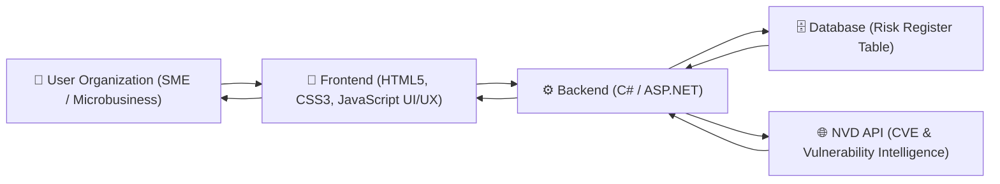
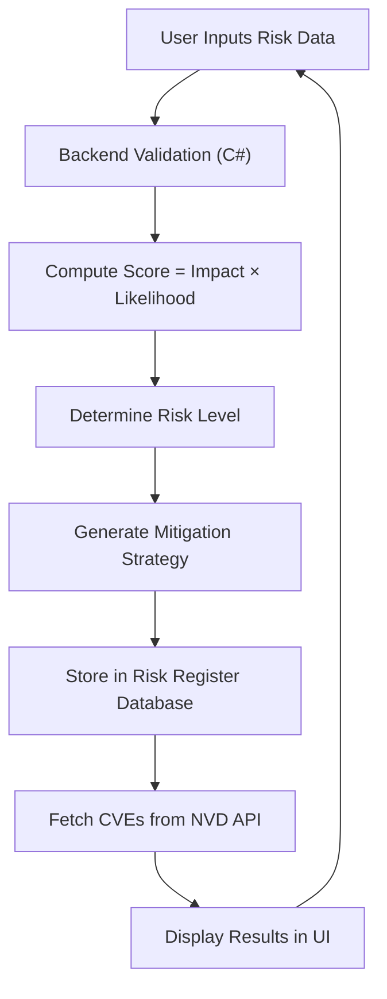
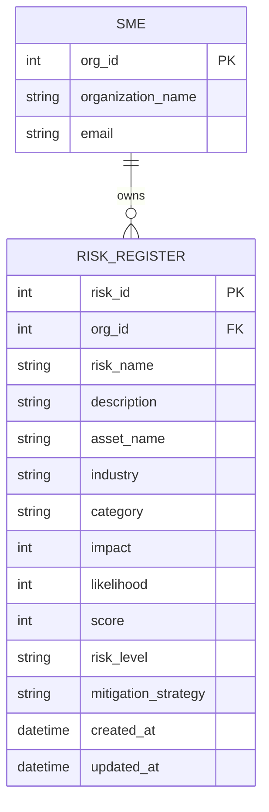

# 🛡️ SentinelWeave AI

### Cyber Risk Register & Visualization Platform for SMEs

---

## 🌐 Project Overview

SentinelWeave AI is a cybersecurity risk management web application designed for small and medium-sized enterprises and microbusinesses that operate without dedicated security teams yet face increasing exposure to cyber threats.

The platform provides a structured and intuitive way to document, assess, and manage cyber risks through a centralized risk register. It combines automated risk scoring, tailored mitigation strategies, and visual dashboards to help organizations understand and prioritize their security posture.

Rather than overwhelming users with technical complexity, SentinelWeave translates cybersecurity into a practical, accessible workflow that supports real-world decision-making.

---

## 🎯 Purpose

The purpose of SentinelWeave AI is to bridge the gap between cybersecurity expertise and business usability.

The platform enables organizations to:

* Understand their cyber risks in a structured manner
* Prioritize vulnerabilities based on severity
* Take actionable mitigation steps
* Visualize organizational risk exposure clearly

---

## 👥 Target Audience

* Small and Medium Enterprises (SMEs)
* Startups and SaaS companies
* Microbusinesses
* Founders and operational teams

---

## ⚙️ Core Features

### 📝 Risk Register (CRUD System)

Create, view, update, and delete structured cyber risk entries.

### 📊 Automated Risk Scoring

Risk score is computed dynamically as Impact multiplied by Likelihood.

### 🧠 Mitigation Strategy Generation

Tailored mitigation recommendations based on asset, category, and risk level.

### 🔥 Organizational Dashboard

Color-coded heat map visualization for intuitive risk prioritization.

### 🌐 Threat Intelligence Integration

Integration with external vulnerability data sources to provide real-world context.

### 🔐 Secure Authentication

User authentication with validation and secure handling of inputs.

---

## 🧱 Technology Stack

### Frontend

HTML5
CSS3
JavaScript

### Backend

C# using ASP.NET
RESTful API architecture

### Database

SQL-based system (PostgreSQL or SQL Server recommended)

### Web Service Integration

Integration with the **National Vulnerability Database (NVD) API**

Purpose of API:

* Retrieve known vulnerabilities (CVEs)
* Provide severity scoring (CVSS)
* Enhance user awareness of threats affecting their assets

---

## 🏗️ System Architecture

---

### 🔍 Component Interaction

The user organization interacts with a clean frontend interface to manage risks.

The frontend communicates with the backend, which:

* Validates inputs
* Calculates risk score
* Determines risk level
* Generates mitigation strategies

The backend stores all information in the database and integrates with the NVD API to fetch relevant vulnerabilities associated with user-defined assets.

---

## 🔄 Application Workflow

---

## 🧾 Risk Data Model

Each risk entry includes:

* Risk Name
* Description
* Asset Name
* Industry
* Category (Confidentiality, Integrity, Availability)
* Impact (1–10)
* Likelihood (1–10)
* Score (automatically calculated)
* Risk Level (Low, Medium, High)
* Mitigation Strategy

---

## 🗄️ Database Schema (ERD)

---

## 🌍 API Integration (NVD)

The system integrates with the National Vulnerability Database API to provide real-world cybersecurity intelligence.

When a user inputs an asset, the system retrieves:

* Known vulnerabilities (CVEs)
* Severity scores (CVSS)
* Vulnerability descriptions

This allows organizations to understand how their assets are exposed to real-world threats and strengthens decision-making.

---

## 🎨 UI / UX Design

The application follows a clean and minimal design approach:

* Light theme with subtle color usage
* Clear navigation across modules
* Real-time system feedback
* Accessible and responsive layout

Design is aligned with usability principles to ensure ease of use for non-technical users.

---

## 📊 Dashboard Capabilities

* Risk heat map visualization
* Distribution of risks by severity
* Identification of high-risk assets
* Display of relevant cybersecurity threats

---

## 📅 Development Timeline

Week 1
Project setup and database schema design

Week 2
Backend CRUD implementation

Week 3
Frontend development

Week 4
Risk scoring and mitigation logic

Week 5
Dashboard and API integration

Week 6
Security implementation and testing

---

## ⚠️ Challenges and Mitigation

### Data Accuracy

Users may provide inconsistent inputs
Solution: Input validation and structured fields

### API Reliability

External APIs may have limitations
Solution: Error handling and fallback mechanisms

### Security Risks

User inputs may introduce vulnerabilities
Solution: Input sanitization and authentication

### Usability

Cybersecurity complexity for SMEs
Solution: Simple interface and guided workflows

---

## 🚀 Future Enhancements

* AI-driven risk predictions
* Advanced analytics dashboards
* Compliance mapping (NIST, ISO)
* Multi-organization support

---

## 👤 Author

**Vanya Sahi**
AI Cybersecurity Architect

Focused on building systems at the intersection of:

* Cyber risk analysis
* Threat intelligence
* Practical AI-driven security solutions

---

### 🛡️ SentinelWeave AI

Making Cyber Risk Understandable, Actionable, and Visual

